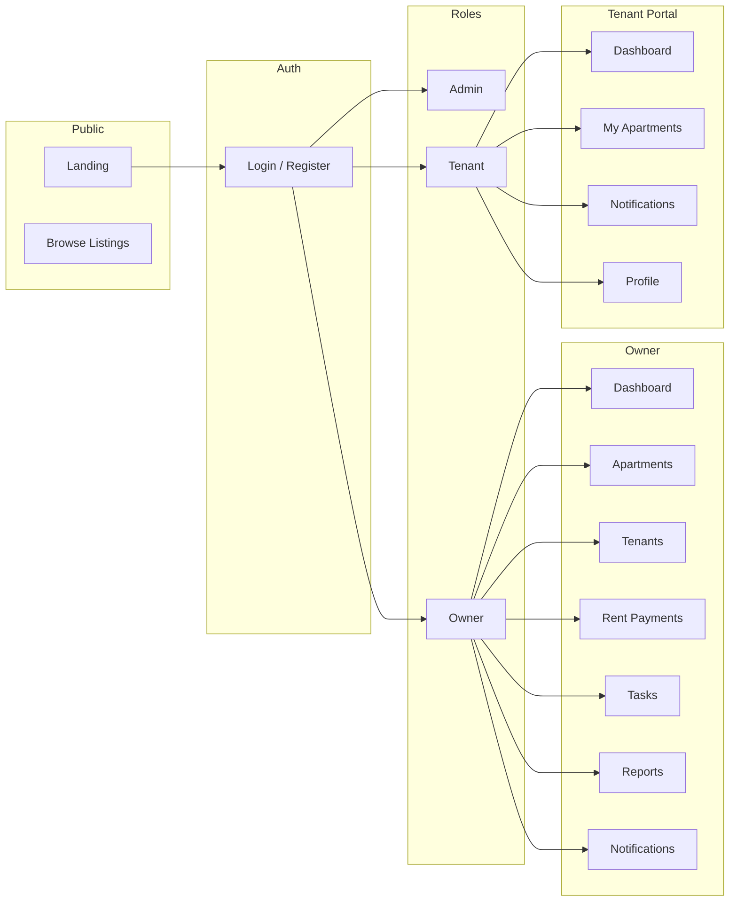

# Rentory — Apartment Rental Management System

Rentory helps property owners manage apartments, tenants, rent payments, and maintenance tasks in one place. It provides a tenant portal for renters and admin oversight for platform operators. Roles: **admin**, **owner**, and **tenant**.

<p align="center">
  
  
  
</p>

## About

Rentory is a role-based apartment rental management web application. Property **owners** get a dashboard, apartment and tenant management, rent payment tracking, task boards (Kanban), reports, and in-app notifications. **Tenants** use a mobile-first portal to view their unit, payments, and notifications. **Admins** manage users and locations and monitor all owners, tenants, and apartments. The public landing page can be paired with an optional marketplace to browse and search available units.

## Problems Solved

- **Scattered rental operations** — Centralizes properties, tenants, payments, and tasks in one place for owners.
- **Late and missed rent** — Tracks due/paid/overdue status and notifies owners of overdue payments.
- **Lease expiration surprises** — Scheduled checks create notifications for leases expiring in 30, 60, and 90 days.
- **No visibility into performance** — Owners get occupancy rate, revenue (monthly/yearly), collection rate, and task completion metrics.
- **Tenant experience** — Tenants have a dedicated portal to see their unit and notifications.
- **Admin oversight** — Admins can monitor all owners, tenants, and apartments and manage locations and users.
- **Discovery** — Public can discover available units when the listing/marketplace view is used.

## Features

### Public

- Marketing landing page (hero, features, about, pricing, contact).
- Optional marketplace: browse and search available apartments by location, rent range, and bedrooms.

### Owners

- **Dashboard** — Metrics for apartments, occupancy, tenants, revenue, payments (pending/overdue/paid), collection rate, tasks, and task completion.
- **Apartments** — Full CRUD; locations; status (available, occupied, maintenance); images and amenities; optional S3 storage.
- **Tenants** — Full CRUD; link to user account for portal access; lease dates, deposit, rent, emergency contact.
- **Rent payments** — Full CRUD; due/payment dates; status (pending, paid, overdue) with auto-overdue; payment method and reference.
- **Tasks** — Kanban board (todo, in progress, done, cancelled); linked to apartment/tenant; comments; notifications on create/update.
- **Reports** — Revenue, occupancy, and tenant turnover reports.
- **Notifications** — In-app list for overdue payments, lease expirations, and task updates.

### Tenants

- **Portal** (mobile-first, bottom nav): dashboard, my apartments, notifications, profile; payment and lease metrics.

### Admins

- **User management** — CRUD for users with role assignment.
- **Locations** — CRUD; used to organize and filter apartments.
- **Monitoring** — List and detail views for owners, tenants, and apartments (read-only).

### Automation

- **Scheduled notifications** — Daily job checks overdue rent payments and lease expirations (30, 60, 90 days) and creates in-app notifications; duplicate prevention per day. Manual run: `php artisan notifications:check`.

## Application Flow



## Tech Stack

| Layer | Technologies |
|-------|--------------|
| **Backend** | PHP 8.2+, Laravel 12, Eloquent ORM |
| **Frontend** | Livewire 4, Mary UI, Tailwind CSS 4, DaisyUI 5, Vite 7 |
| **Key packages** | `livewire/livewire` ^4.0, `robsontenorio/mary` ^2.6, `league/flysystem-aws-s3-v3` ^3.0 (optional S3) |
| **Dev tools** | Laravel Pint, Laravel Pail, Laravel Sail, PHPUnit, Faker |

### NPM / Frontend

- `laravel-vite-plugin`, `vite`, `@tailwindcss/vite`, `tailwindcss`, `daisyui`, `axios`, `sortablejs` (Kanban), `concurrently` (dev script).

## Requirements

- PHP 8.2 or higher
- Composer
- Node.js and npm
- SQLite (default), or MySQL/PostgreSQL if configured

## Installation

1. Clone the repository.
2. Install PHP dependencies: `composer install`
3. Copy environment file: `cp .env.example .env`
4. Generate app key: `php artisan key:generate`
5. Configure database in `.env` (e.g. SQLite).
6. Run migrations: `php artisan migrate`
7. Install frontend dependencies and build: `npm install && npm run build`

Alternatively, use the setup script (if it matches your environment):

```bash
composer setup
```

## Running the Application

**Full dev environment** (server, queue worker, logs, Vite):

```bash
composer dev
```

**Minimal run:**

```bash
php artisan serve
npm run dev
```

For scheduled notifications (overdue payments, lease expirations), run the queue worker and the scheduler:

```bash
php artisan queue:work
php artisan schedule:work
```

Or add a cron entry: `* * * * * cd /path-to-app && php artisan schedule:run >> /dev/null 2>&1`

## Scheduled Tasks

- **Daily notification check** — Runs at the time configured in `routes/console.php` (e.g. Asia/Manila). The job `SendScheduledNotificationsJob` calls `NotificationService::runAllChecks()` to create in-app notifications for overdue rent payments and for leases expiring in 30, 60, and 90 days.
- **Manual run:** `php artisan notifications:check`

## Project Structure (Brief)

| Path | Purpose |
|-----|---------|
| `app/Models` | Eloquent models (User, Apartment, Tenant, RentPayment, Task, Notification, Location, etc.) |
| `app/Services` | OwnerMetricsService, TenantMetricsService, NotificationService |
| `app/Console/Commands` | `notifications:check` (overdue payments & lease expirations) |
| `app/Jobs` | SendScheduledNotificationsJob (queued) |
| `app/Http/Middleware` | CheckRole (admin, owner, tenant) |
| `resources/views/pages` | Livewire full-page and SFC components (e.g. dashboard, apartments, tenants, portal) |
| `routes/web.php` | Role-based routes; Livewire pages via `Route::livewire()` |

## Documentation

- [AGENT.md](AGENT.md) — Coding standards, conventions, and tech stack details for contributors and AI agents.
- [NOTIFICATION_DEMO_README.md](NOTIFICATION_DEMO_README.md) — Notification demo steps (if present).

## License

This project is open-sourced software licensed under the [MIT license](https://opensource.org/licenses/MIT).
